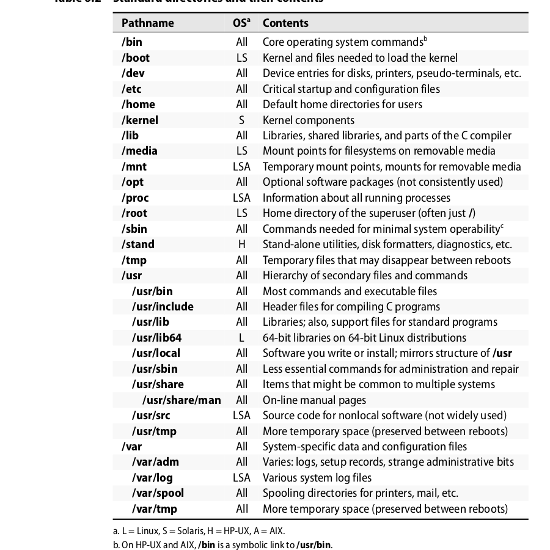

# Filesystem

## Pathnames

* scripts must deal with **whitespace in file names**

**When you are writing scripts, a useful weapon to know about is `find’s -print0` option. In combination with xargs -0, this option makes the find/xargs combination work correctly regardless of the whitespace contained within filenames.For example, the command `$ find /home -type f -size +1M -print0 | xargs -0 ls -l` prints a long ls listing of every file in /home over one megabyte in size.**

## mounting and unmounting

* filesystems are attached to filesystem tree with **mount**
* **sudo mount /dev/sda4 /my_mount_point**
* list of currently mounted filesystems in **/etc/fstab**
* detach filesystems with **umount**
  * complains if filesystem is still in use (force with **-f** - only useful on NFS)
  * better idea: check all active proecesses with **fuser -c /my_mount_point**
  * run fuser with **-v** flag for readable output!
  * alternative **lsof**

## file tree organization

## file types

* regular files
* directories
* character device files
* block device files
* local domain sockets
* named pipes (FIFO)
* symlinks

* determine file type with **ls -ld**
* first character = file type
  * d = dir
  * - = reg. file
  * l = sym link
  * c, b, s, p = rest
* delete file named '-f' with **rm -- '-f'** --> -- = everything after is not a flag
* when using rm with **shell-globbing** always use *-i flag*

### regular files

* series of bytes
* no structure
* e.g. text files, executables, data files, shared libraries

### directories

* file name is stored within its parent dir
* more than one dir can refer to file at a time
* called **hard links**
* create with **ln** (mirrors syntax of *cp) and remove with **rm**

### character and block device files

* device files let programs communicate with system's hardware and peripherals
* kernel loads driver software for each system device
* request to **character or block device** gets passed to appropiate device driver
* device files are only rendezvous points to communicate with drivers, not drivers themselves
  
*Character device files allow their associated drivers to do their own input and output buffering. Block device files are used by drivers that handle I/O in large chunks and want the kernel to perform buffering for them. In the past, a few types of hardware were represented by both block and character device files, but that configuration is unusual today.*

### local domain sockets

* connection between processes, which allows them to communicate
* only accessible from **localhost**
* only visible to processes involved in communcation
* examples: **syslog or X**

### named pipes

* allow communcation between processes running on same host
* require few admin work

### symlinks

*  points to a filename
*  created with **ln -s** (mirror syntax of *cp*)
*  reference by name, instead of direct reference (like in hard links)
* distrinct from the files they point to

## file attributes

* nine permission bits
* bits with octal values 4000 and 2000 are **setuid and setgid bits**
* when set on dir, setgid causes newly created files within dir to take group ownership of the dir, rather than the default group of the user
  * makes it easier to share dirs of files among several users in the same group

## ls - inspect files

* **-i** shows inode number 
* **-t** sort by modification date
* **-h** human-readable

## chmod and chown

* **-R** recursely updates file permissions within a dir
* only useful with mnemonic syntax (e.g. u+x)
* change ownership of file with **chown**
* also has **-R**
* chown **user:group file** changes group and owner of file at once
* user can be omitted (e.g. :group) --> default user
* default permission is set with **umask**
* linux (ext fs) extra functions **lsattr and chattr**, define extra permissions

## ACL

*Virtually all non-UNIX operating systems use a more complicated way of regulat-ing access to files: access control lists, aka ACLs. Each file or directory can have an associated ACL that lists the permission rules to be applied to it. Each of the rules within an ACL is called an access control entry, or ACE.*

* siehe link (http://wiki.ubuntuusers.de/ACL) 
* siehe unix handbook, p. 159+

