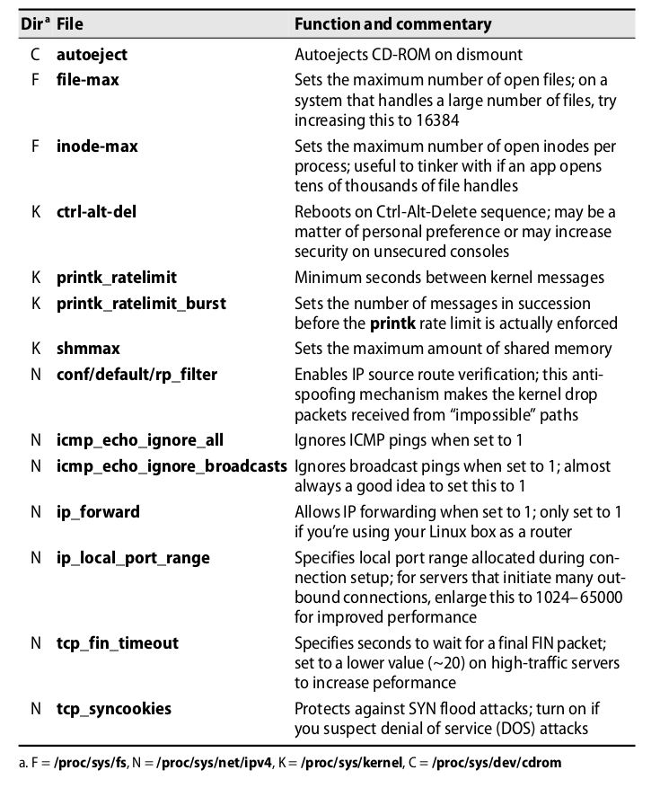

# Kernel

* almost all UNIX kernels are **monolithic**
* kernel build dir in Linux - **/boot/vmlinuz**

## Drivers and device files

* **/dev**
* device drivers are part of kernel
* get **major minor number** of device file with **ls -l**
* **udevadm** (and **udevd**) command on Linux to manage device files

* alternatively use **sysctl** command
* kernel source files are in **/usr/src**

## adding a linux device driver

* see **Unix handbook p. 425+**

## loadable kernel modules

* inspect with **lsmod**
* insert into kernel with **insmod** or **modprobe**

## UDEV

* sysfs located under **/sys**
* important command **udevadm info DEVICE**
* 